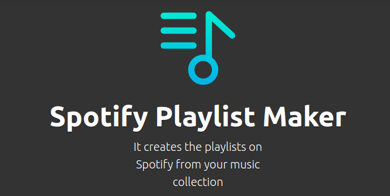

# Spotify Playlist Maker

This is a TypeScript app for creating playlists starting from your music files on your computer. This is the simplified flow, also described [by this diagram](./flow.drawio):

* an Express server is started, with a callback route used for receiving the access token from Spotify. This is the only possible OAuth grant for managing user's playlist
* Once you've logged in, you'll see a simple UI with your main details, a section for starting the scanning and a table with your current remote playlists.
* Once you hit the "Start" button, the app will traverse the file system starting for the main specified directory and using the first-level deep directories' names as playlists' names and the files' names contained there as songs to be added to the playlists.
* The spotify IDs relative to the tracks found by the scanner will be saved inside the "Comment" metatag of your files. **Any previous comment will be deleted**. This passage is useful for avoid duplicates and the idempotency of multiple execution on the same files.

## Constraints and rules

* If a playlist's name is already present among spotify's playlists, its ID will be used and we won't create a new one.
* If a song's name is already present inside a playlist, it will be skipped. I save the spotify ID inside the "comment" metatag of each file to make comparisons.
* Despite the fact Spotify UI has folders in which you can organize your playlists, their API doesn't give the possibility to manage them. That said, only the first-level deep directories will be used as main playlists, eventual subdirectories will be absorbed by the parent playlist.
* API requests are performed one after another to respect [Spotify's rate limits](https://developer.spotify.com/documentation/web-api/guides/rate-limits)
* Once started, if you want to abort the process you must kill the app. The server uses Server-sent events to communicate the progress of the operation, so the communication flow is just in one direction, from the server to the client.

## Resources

* logo: [kiranshastry](https://www.flaticon.com/free-icon/playlist_876334)